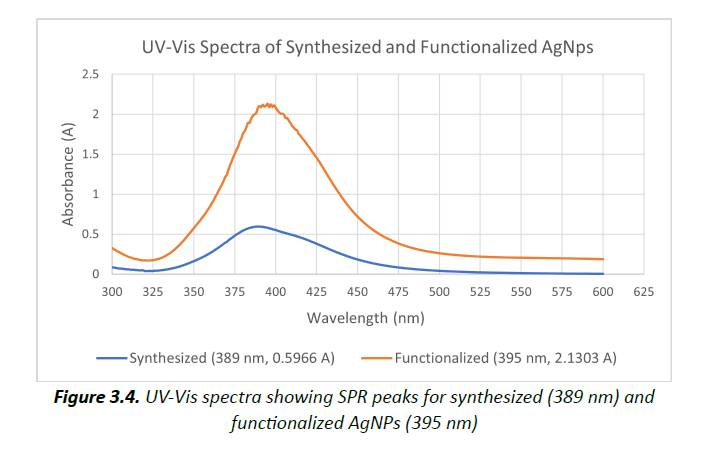
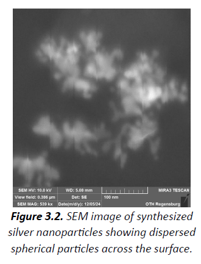

# Silver Nanoparticles for Milk Spoilage Detection
(Project Thesis)

This repository presents a portfolio summary of my project thesis completed at OTH Regensburg as part of the course
“Nanoparticles for Information Technology and Sensing”.

## Project overview
The project focused on the synthesis, functionalization, and characterization of silver nanoparticles (AgNPs)
for potential application in milk spoilage detection using a colorimetric sensing approach.

Cysteamine hydrochloride was used to functionalize AgNPs to enhance interaction with spoilage markers such as lactic acid.

## Key work performed
- Chemical synthesis of silver nanoparticles using sodium borohydride and tri-sodium citrate
- Functionalization of AgNPs with cysteamine hydrochloride
- Characterization using UV-Vis spectroscopy, Dynamic Light Scattering (DLS), and SEM
- Application testing on fresh, pre-spoiled, and spoiled milk samples
- Analysis of limitations and sensitivity challenges

## Repository contents
- `docs/`: technical project summary and methodology
- `images/`: selected experimental results and characterization figures
- `code/`: placeholder for non-confidential examples (no code publicly shared)

## Notes
The complete project report, raw experimental data, and lab procedures are not publicly shared.
This repository is intended as an academic and technical portfolio summary.
